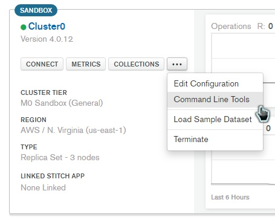

It's based on [SWE Online -  GraphQL Curriculum Day 3 - Online Store (part 1)](https://open.appacademy.io/learn/swe-online/swe-online---graphql-curriculum/online-store--part-1-)


## Project Initialization

* Create a directory called `online-store`
* `npm init --y`
* Follow the prompts to fill out information about your project. Choose the default entry point of `index.js.`

Run `npm install jsonwebtoken bcryptjs validator nodemon express-graphql express express-graphql mongoose body-parser concurrently cors`

### Express setup
Create a file in root directory called `index.js` and add the following code:


```js
const express = require("express");

const app = require("./server/server");

const port = process.env.PORT || 5000;

app.listen(port, () => {
  console.log(`Server listening on port ${port}`);
});
```
### Connecting to MongoDB Atlas
 
 [Refer to this guy](./mongoDB.md#mongodb-altas-set-up)

Create a new folder called `server`.
Create a file within your new directory called `server.js`.
Configure your server file to connect to Atlas:
```js
//server/server.js
const express = require("express");
const mongoose = require("mongoose");
const bodyParser = require("body-parser");
const db = require("../config/keys.js").MONGO_URI;
const expressGraphQL = require("express-graphql");
const models = require("./models/index");
const schema = require("./schema/schema.js");
const app = express();
const cors = require("cors");

if (!db) {
  throw new Error("You must provide a string to connect to MongoDB Atlas");
}

mongoose
  .connect(db, { useNewUrlParser: true, useUnifiedTopology: true })
  .then(() => console.log("Connected to MongoDB successfully"))
  .catch(err => console.log(err));

// remember we use bodyParser to parse requests into json
app.use(bodyParser.json());
app.use(cors());
// use the expressGraphQL middleware to connect our GraphQLSchema to Express
app.use("/graphql", expressGraphQL(req => {
    return {
      schema,
      // we are receiving the request and can check for our
      // auth token under headers
      context: {
        token: req.headers.authorization
      },
      graphiql: true
    };
  })
);

module.exports = app;
```

### Creating the Models
Create a new `models` folder within the `server` directory to write the models for `Product`, `Category`, and `User`. Let's take a look at the `PRoduct` model:
```js
// server/models/Product.js

const mongoose = require("mongoose");
const Schema = mongoose.Schema;

const ProductSchema = new Schema({
  name: {
    type: String,
    required: true
  },
  category: {
    type: Schema.Types.ObjectId,
    ref: "categories"
  },
  description: {
    type: String,
    required: true
  },
  weight: {
    type: Number,
    required: false
  }
});

ProductSchema.statics.updateProductCategory = (productId, categoryId) => {
  const Product = mongoose.model("products");
  const Category = mongoose.model("categories");
  return Product.findById(productId).then(product => {
    // if the product already had a category
    if (product.category) {
        // find the old category and remove this product from it's products
        Category.findById(product.category).then(oldcategory => {
            oldcategory.products.pull(product);
            return oldcategory.save();
        });
    }
    //  find the Category and push this product in, as well as set this product's category
    return Category.findById(categoryId).then(newCategory => {
      product.category = newCategory;
      newCategory.products.push(product);
      
      return Promise.all([product.save(), newCategory.save()]).then(
        ([product, newCategory]) => product
      );
    });
  });
};

module.exports = mongoose.model("products", ProductSchema);
```

```js
// server/models/User.js
const mongoose = require("mongoose");
const Schema = mongoose.Schema;

const UserSchema = new Schema({
    name: {
      type: String,
      required: true
    },
    email: {
      type: String,
      required: true
    },
    password: {
        type: String,
        required: true,
        min: 8,
        max: 32
    },
    date: { 
      type: Date, 
      default: Date.now 
    }
});

module.exports = mongoose.model("user", UserSchema);
```
```js
// server/models/Category.js

const mongoose = require("mongoose");
const Schema = mongoose.Schema;

const CategorySchema = new Schema({
  name: {
    type: String,
    required: true
  },
  products: [
    {
      type: Schema.Types.ObjectId,
      ref: "products"
    }
  ]
})

CategorySchema.statics.findProducts = function (categoryId) {
  return this.findById(categoryId)
    .populate("products")
    .then(category => category.products);
};

module.exports = mongoose.model("categories", CategorySchema);
```

For convenience, we can create an index file to import all files in one go:
```js
// server/models/index.js

require("./User");
require("./Category");
require("./Product");
```

### Populating the Database (if applied)

* Download data and unzip then `cd` into that directory.
* Then, from the cluster page, go to the `Command Line Tools` tab and copy the first command under `Binary Import and Export Tools`. 

  
  
Change the password to your database user’s password, then, on the end of the command, add `--db <yourdbname>` followed by the name of one of the `bson` files (to only seed one), or `.` for all files.
  * Ensure that the `--db` flag is followed by the name of the database you are using for today's project. The name of your database can also be found in your `MONGO_URI`.

For example, I used the following command to seed emblems (don't copy this exactly, use your own cluster info + password + db name):

`mongorestore --host Cluster0-shard-0/cluster0-shard-00-00-wvgce.mongodb.net:27017,cluster0-shard-00-01-wvgce.mongodb.net:27017,cluster0-shard-00-02-wvgce.mongodb.net:27017 --ssl --username <yourdbuser> --password <yourpassword> --authenticationDatabase admin --db <yourdbname> emblems.bson`
* Once you've executed the command, the greek gods data will be uploaded to your database.


### Wriging Schema
* Within the `server` directory, create a new folder called `schema`.
* Within `schema`, create a new directory called `types`
* Within types, create a new file called `category_type.js`.

```js
//server/schema/types/category_type.js
const mongoose = require("mongoose");
const graphql = require("graphql");
const { GraphQLObjectType, GraphQLString, GraphQLID, GraphQLList } = graphql;
const Category = mongoose.model("categories");

const CategoryType = new GraphQLObjectType({
  name: "CategoryType",
  // remember we wrap the fields in a thunk to avoid circular dependency issues
  fields: () => ({
    id: { type: GraphQLID },
    name: { type: GraphQLString },
    products: { 
      type: new GraphQLList(require("./product_type")),
      resolve(parentValue) {
          return Category.findProducts(parentValue.id, "products")
      }
    }
  })
});

module.exports = CategoryType;
```

```js
//server/schema/types/product_type.js
const mongoose = require("mongoose");
const graphql = require("graphql");
const { GraphQLObjectType, GraphQLString, GraphQLID } = graphql;

const Product = mongoose.model("products");

const ProductType = new GraphQLObjectType({
  name: "ProductType",
  // remember we wrap the fields in a thunk to avoid circular dependency issues
  fields: () => ({
    id: { type: GraphQLID },
    // user: { type: GraphQLObjectType },
    name: { type: GraphQLString },
    category: {
        type: require("./category_type"),
        resolve(parentValue){
            return Product.findById(parentValue._id)
            .populate("category")
            .then(product => product.category)
        }
    },
    description: { type: GraphQLString },
    weight: { type: GraphQLString }
  })
});

module.exports = ProductType;
```

```js
//server/schema/types/user_type.js
const mongoose = require("mongoose");
const graphql = require("graphql");
const { GraphQLObjectType, GraphQLString, GraphQLID, GraphQLBoolean } = graphql;

const UserType = new GraphQLObjectType({
    name: "UserType",
    // remember we wrap the fields in a thunk to avoid circular dependency issues
    fields: () => ({
        id: { type: GraphQLID },
        name: { type: GraphQLString },
        email: { type: GraphQLString },
        token: { type: GraphQLString },
        loggedIn: { type: GraphQLBoolean }

    })
});

module.exports = UserType;
```

#### Root Queries
```js
//server/schema/types/root_types.js

const mongoose = require("mongoose");
const graphql = require("graphql");
const { GraphQLObjectType, GraphQLList, GraphQLID, GraphQLNonNull } = graphql;

const UserType = require("./user_type");
const CategoryType = require("./category_type");
const ProductType = require("./product_type");

const User = mongoose.model("user");
const Category = mongoose.model("categories");
const Product = mongoose.model("products");

const RootQueryType = new GraphQLObjectType({
  name: "RootQueryType",
  fields: () => ({
    users: {
      type: new GraphQLList(UserType),
      resolve() {
        return User.find({});
      }
    },
    user: {
      type: UserType,
      args: { _id: { type: new GraphQLNonNull(GraphQLID) } },
      resolve(_, args) {
        return User.findById(args._id);
      }
    },
    products: {
      type: new GraphQLList(ProductType),
      resolve(){
        return Product.find({});
      }
    },
    product: {
      type: ProductType,
      args: { _id: { type: new GraphQLNonNull(GraphQLID) } },
      resolve(_, args) {
        return Product.findById(args._id);
      }
    },
    categories: {
        type: new GraphQLList(CategoryType),
        resolve() {
            return Category.find({});
        }
    },
    category: {
        type: CategoryType,
        args: { _id: { type: new GraphQLNonNull(GraphQLID) } },
        resolve(_, args) {
            return Category.findById(args._id);
        }
    }
  })
});

module.exports = RootQueryType;
```

Create a new file withing `schema` called `schema.js` and add the following code:
```js
const graphql = require("graphql");
const { GraphQLSchema } = graphql;
const query = require("./types/root_query_type");
const mutation = require("./mutations");

module.exports = new GraphQLSchema({
  query,
  mutation
});
```


#### Configuring the Server

Add `const models = require('./models')` to `server/server.js` if needed

Now it's a good timing to go to `localhost:5000/graphql` and test the queries

## Mutations Setup
Within the `schema` directory, create a new file called `mutations.js`. Add the following code to this file:
```js
const graphql = require("graphql");
const { GraphQLObjectType, GraphQLString, GraphQLInt, GraphQLID } = graphql;
const mongoose = require("mongoose");
const UserType = require("./types/user_type");
const CategoryType = require("./types/category_type");
const ProductType = require("./types/product_type");
const AuthService = require("../services/auth");
const Category = mongoose.model("categories");
const Product = mongoose.model("products");

const mutations = new GraphQLObjectType({
  name: "Mutations",
  fields: {
        newCategory:{
          type: CategoryType,
          args: {
              name: { type: GraphQLString },
          },
          resolve(parentValue, { name }) {
              return new Category({ name }).save();
          }
        },
        deleteCategory: {
            type: CategoryType,
            args: { id: { type: GraphQLID }},
            resolve(parentValue, { id }){
                return Category.remove({ _id: id });
            }
        },
        newProduct:{
          type: ProductType,
          args: {
            name: { type: GraphQLString },
            description: { type: GraphQLString },
            weight: { type: GraphQLInt },
          },
          resolve(_, { name, description, weight }) {
            return new Product({ name, description, weight }).save();
          }
        },
        deleteProduct:{
          type: ProductType,
          args: { id: { type: GraphQLID } },
          resolve(parentValue, { id }) {
            return Product.remove({ _id: id });
          }
        },
        updateProductCategory: {
          type: ProductType,
          args: { 
              productId: { type: GraphQLID },
              categoryId: { type: GraphQLID },
             },
            resolve(parentValue, { productId, categoryId }) {
              return Product.updateProductCategory(productId, categoryId);
          }
        },
        register: {
          type: UserType,
          args: {
            name: { type: GraphQLString },
            email: { type: GraphQLString },
            password: { type: GraphQLString }
          },
          resolve(_, args) {
            return AuthService.register(args);
          }
        },
      logout: {
        type: UserType,
        args: {
          // all we need to log the user our is an id
          _id: { type: GraphQLID }
        },
        resolve(_, args) {
          return AuthService.logout(args);
        }
      },
      login: {
        type: UserType,
        args: {
          email: { type: GraphQLString },
          password: { type: GraphQLString }
        },
        resolve(_, args) {
          return AuthService.login(args);
        }
      },
      verifyUser: {
        type: UserType,
        args: {
          token: { type: GraphQLString }
        },
        async resolve(_, { name, description, weight }, ctx) {
          const validUser = await AuthService.verifyUser({ token: ctx.token });
          // if our service returns true then our product is good to save!
          // anything else and we'll throw an error
          if (validUser.loggedIn) {
            return validUser;
          } else {
            throw new Error('Sorry, you need to be logged in to create a product.');
          }
        }
      }
  }
});

module.exports = mutations;
```
# User Authentication

### Validation
Within your `server` directory, create a new folder called `validation`
Create a new file in validation called `valid-text.js` and add the following function:
```js
const validText = str => {
  return typeof str === "string" && str.trim().length > 0;
};

module.exports = validText;
```

Create the corresponding files for these validations - `register.js` and `login.js` - within the validation folder. Let's start writing the `login` validation:
```js
// server/validation/login.js

const Validator = require("validator");
const validText = require("./valid-text");

module.exports = function validateLoginInput(data) {
    data.email = validText(data.email) ? data.email : "";
    data.password = validText(data.password) ? data.password : "";

    if (!Validator.isEmail(data.email)) {
        return { message: "Email is invalid", isValid: false };
    }

    if (Validator.isEmpty(data.email)) {
        return { message: "Email field is required", isValid: false };
    }

    if (Validator.isEmpty(data.password)) {
        return { message: "Password field is required", isValid: false };
    }

    return {
        message: "",
        isValid: true
    };
};
```

```js
//server/validation/register.js

const Validator = require("validator");
const validText = require("./valid-text");

module.exports = function validateRegisterInput(data) {
    data.email = validText(data.email) ? data.email : "";
    data.name = validText(data.name) ? data.name : "";
    data.password = validText(data.password) ? data.password : "";

    if (!Validator.isEmail(data.email)) {
        return { message: "Email is invalid", isValid: false };
    }

    if (Validator.isEmpty(data.email)) {
        return { message: "Email field is required", isValid: false };
    }

    if (Validator.isEmpty(data.password)) {
        return { message: "Password field is required", isValid: false };
    }

    if (Validator.isEmpty(data.name)) {
        return { message: "name field is required", isValid: false };
    }

    return {
        message: "",
        isValid: true
    };
};
```

## Register Service
Create a new folder in your `server` directory called `services`. Within `services`, create a new file called `auth.js`. We're going to need `bcrypt` and `jsonwebtoken`. We also need our secret signature key, as well as the User model from mongoose. We begin to define our async `register` function, which will take the arguments from the mutation passed in as a data object:
```js
// server/services/auth.js

const bcrypt = require("bcryptjs");
const jwt = require("jsonwebtoken");
const User = require("../models/User");
const keys = require("../../config/keys_dev").secretOrKey;

// here is our validator function
const validateRegisterInput = require("../validation/register");
const validateLoginInput = require("../validation/login");

const register = async data => {
    try {
        const { message, isValid } = validateRegisterInput(data);

        if (!isValid) {
            throw new Error(message);
        }

        const { name, email, password } = data;

        const existingUser = await User.findOne({ email });

        if (existingUser) {
            throw new Error("This user already exists");
        }

        const hashedPassword = await bcrypt.hash(password, 10);

        const user = new User(
            {
                name,
                email,
                password: hashedPassword
            },
            err => {
                if (err) throw err;
            }
        );

        user.save();
        // we'll create a token for the user
        const token = jwt.sign({ id: user._id }, keys);

        // then return our created token, set loggedIn to be true, null their password, and send the rest of the user
        const userId = user.id;
        return { token, loggedIn: true, ...user._doc, id: userId, password: null };
    } catch (err) {
        throw err;
    }
};

const logout = async data => {
    try {
        const { _id } = data;

        const user = await User.findById(_id);
        if (!user) throw new Error("This user does not exist");

        const token = "";

        return { token, loggedIn: false, ...user._doc,  password: null };
    } catch (err) {
        throw err;
    }
};

const login = async data => {
    try {
        const { message, isValid } = validateLoginInput(data);

        if (!isValid) {
            throw new Error(message);
        }

        const { email, password } = data;

        const user = await User.findOne({ email });
        if (!user) throw new Error("This user does not exist");

        const isValidPassword = await bcrypt.compareSync(password, user.password);
        if (!isValidPassword) throw new Error("Invalid password");

        const token = jwt.sign({ id: user.id }, keys);
        const userId = user.id;

        return { token, loggedIn: true, ...user._doc, id: userId, password: null };
    } catch (err) {
        throw err;
    }
};

const verifyUser = async data => {
    try {
        // we take in the token from our mutation
        const { token } = data;
        // we decode the token using our secret password to get the
        // user's id
        const decoded = jwt.verify(token, keys);
        const { id } = decoded;

        // then we try to use the User with the id we just decoded
        // making sure we await the response
        const loggedIn = await User.findById(id).then(user => {
            return user ? true : false;
        });

        return { loggedIn };
    } catch (err) {
        return { loggedIn: false };
    }
};
module.exports = { register, login, logout, verifyUser };
```


# Frontend
It's based on [SWE Online -  GraphQL Curriculum Day 4 - Online Store (part 2)](https://open.appacademy.io/learn/swe-online/swe-online---graphql-curriculum/online-store--part-2)


In the root directory of the project, run `npx create-react-app client --use-npm`
Add four new scripts to your package.json in the root of your project:
```json
  "scripts": {
    "start": "node index.js",
    "client-install": "npm install --prefix client",
    "client": "npm start --prefix client",
    "server": "nodemon index.js",
    "dev": "concurrently \"npm run server\" \"npm run client\""
  },
```

In the `client` folder, run `npm install react react-dom react-router-dom apollo-client apollo-cache-inmemory apollo-link-http react-apollo apollo-link-error apollo-link graphql graphql-tag`

Head over to `client/src/index.js`, add the following code:
```js
import React from 'react';
import ReactDOM from 'react-dom';
import './index.css';
import App from './components/App';
import * as serviceWorker from './serviceWorker';
import ApolloClient from "apollo-client";
import { InMemoryCache } from "apollo-cache-inmemory";
import { createHttpLink } from "apollo-link-http";
import { ApolloProvider } from "react-apollo";
import { HashRouter } from 'react-router-dom'
import { onError } from "apollo-link-error";
import { VERIFY_USER } from "./graphql/mutations";

const cache = new InMemoryCache({
  dataIdFromObject: object => object._id || null
});

// if we have a token we want to verify the user is actually logged in
const token = localStorage.getItem("auth-token");

// to avoid components async problems where
// a component would try to read the cache's value of isLoggedIn
// before our mutation goes through we can set it up here
cache.writeData({
  data: {
    isLoggedIn: Boolean(token)
  }
});


const httpLink = createHttpLink({
  uri: "http://localhost:5000/graphql",
  headers: {
    // pass our token into the header of each request
    authorization: localStorage.getItem("auth-token")
  }
});

// make sure we log any additional errors we receive
const errorLink = onError(({ graphQLErrors }) => {
  if (graphQLErrors) graphQLErrors.map(({ message }) => console.log(message));
});

const client = new ApolloClient({
  link: httpLink,
  cache,
  onError: ({ networkError, graphQLErrors }) => {
    console.log("graphQLErrors", graphQLErrors);
    console.log("networkError", networkError);
  }
});

// then if we do have a token we'll go through with our mutation
if (token) {
  client
    // use the VERIFY_USER mutation directly use the returned data to know if the returned
    // user is loggedIn
    .mutate({ mutation: VERIFY_USER, variables: { token } })
    .then(({ data }) => {
      cache.writeData({
        data: {
          isLoggedIn: data.verifyUser.loggedIn
        }
      });
    });
}

const Root = () => {
    return (
        <ApolloProvider client={client}>
          <HashRouter>
              <App />
          </HashRouter>
        </ApolloProvider>
    );
};

ReactDOM.render(<Root />, document.getElementById("root"));

// If you want your app to work offline and load faster, you can change
// unregister() to register() below. Note this comes with some pitfalls.
// Learn more about service workers: https://bit.ly/CRA-PWA
serviceWorker.unregister();
```

Head over to `client/src/App.js`:

```js
//client/src/App.js
import React from "react";
import ProductIndex from "./products/ProductIndex";
import Login from "./components/Login";
import Register from "./components/Register";
import { Route, Switch } from 'react-router-dom';
import AuthRoute from "./util/route_util";
import Nav from "./components/Nav";
import ProductShow from "./products/ProductShow";
import CreateProduct from "./products/CreateProduct";

const App = () => {
  return (
    <div>
      <Nav />
      <h1>Online Store</h1>
      <Switch>
        <AuthRoute exact path="/login" component={Login} routeType="auth" />
        <AuthRoute exact path="/register" component={Register} routeType="auth" />
        <AuthRoute exact path="/create_product" component={CreateProduct} />
        <Route path="/:id" component={ProductShow}/>
        <Route exact path="/" component={ProductIndex} />
      </Switch>
    </div>
  );
};

export default App;
```

## Frontend User Authentication
Create a folder `components` and a folder `graphql` within `client/src`
Create a file `mutations.js` under `src/graphql`
Let's start by adding our frontend mutation to `client/src/graphql/mutations.js`:
```js
//client/src/graphql/mutations.js
import gql from "graphql-tag";

const LOGIN_USER = gql`
  mutation LoginUser($email: String!, $password: String!) {
    login(email: $email, password: $password) {
      token
      loggedIn
    }
  }
`;

const REGISTER_USER = gql`
  mutation RegisterUser($name: String!, $email: String!, $password: String!) {
    register(name: $name, email: $email, password: $password) {
      token
      loggedIn
    }
  }
`;

const VERIFY_USER = gql`
  mutation VerifyUser($token: String!) {
    verifyUser(token: $token) {
      loggedIn
    }
  }
`;

const CREATE_PRODUCT = gql`
  mutation newProduct($name: String!, $description: String!, $weight: Int!) {
    newProduct(name: $name, description: $description, weight: $weight) {
      id
      name
      description
      weight
    }
  }
`;

export { LOGIN_USER, VERIFY_USER, REGISTER_USER, CREATE_PRODUCT };
```
Create `Login.js` under `client/src/components`:

```js
//client/src/components/Login.js
import React, { Component } from 'react';
import { Mutation } from "react-apollo";
import {LOGIN_USER} from "../graphql/mutations";

class Login extends Component {
  constructor(props) {
    super(props);

    this.state = {
      email: "",
      password: ""
    };
  }

  update(field) {
    return e => this.setState({ [field]: e.target.value });
  }

  updateCache(client, { data }) {
    // here we can write directly to our cache with our returned mutation data
    client.writeData({
      data: { isLoggedIn: data.login.loggedIn }
    });
  }

  render() {
    return (
      <Mutation
        mutation={LOGIN_USER}
        onCompleted={data => {
          const { token } = data.login;
          localStorage.setItem("auth-token", token);
          this.props.history.push("/");
        }}
        update={(client, data) => this.updateCache(client, data)}
      >
        {loginUser => (
          <div>
            <form
              onSubmit={e => {
                e.preventDefault();
                loginUser({
                  variables: {
                    email: this.state.email,
                    password: this.state.password
                  }
                });
              }}
            >
              <input
                value={this.state.email}
                onChange={this.update("email")}
                placeholder="Email"
              />
              <input
                value={this.state.password}
                onChange={this.update("password")}
                type="password"
                placeholder="Password"
              />
              <button type="submit">Log In</button>
            </form>
          </div>
        )}
      </Mutation>
    );
  }
}

export default Login;
```

Create a file `queries.js` under `client/src/graphql`

```js
//client/src/graphql/queries.js
import gql from "graphql-tag";

export default {
  IS_LOGGED_IN: gql`
    query IsUserLoggedIn {
      isLoggedIn @client
    }
  `
}
```

Now, once we have imported this query to our `route_util`, we can write an AuthRoute component. This component will act as both our 'protected' and 'authentication' route based on the `routeType`:

```js
//client/src/util/route_util.js
import React from "react";
import { Route, Redirect } from "react-router-dom";
import { Query } from "react-apollo";
import Queries from "../graphql/queries";
const { IS_LOGGED_IN } = Queries;

// our route switches on routeType
const AuthRoute = ({
  component: Component,
  path,
  exact,
  routeType,
  ...rest
}) => (
    <Query query={IS_LOGGED_IN}>
      {({ data }) => {
        // if the route type is "auth" then this route will only render if the
        // user is not logged in - useful for authentication routes
        // like login or register
        if (routeType === "auth") {
          return (
            <Route
              path={path}
              exact={exact}
              render={props =>
                !data.isLoggedIn ? <Component {...props} /> : <Redirect to="/" />
              }
            />
          );
        } else {
          // otherwise this will be a protected route which will only
          // render the component if the user is logged in
          return (
            <Route
              {...rest}
              render={props =>
                data.isLoggedIn ? (
                  <Component {...props} />
                ) : (
                    <Redirect to="/login" />
                  )
              }
            />
          );
        }
      }}
    </Query>
  );

export default AuthRoute;
```

#### Navigation
In the components directory create a new file named `Nav.js`. We can start with a simple link to login:
```js
// components/Nav.js
import React from 'react';
import { Query, ApolloConsumer } from "react-apollo";
import Queries from "../graphql/queries";
import { Link, withRouter } from 'react-router-dom';
const { IS_LOGGED_IN } = Queries;

const Nav = props => {
    return (
        <ApolloConsumer>
            {client => (
                <Query query={IS_LOGGED_IN}>
                    {({ data }) => {
                        if (data.isLoggedIn) {
                            return (
                                <button
                                    onClick={e => {
                                        e.preventDefault();
                                        localStorage.removeItem("auth-token");
                                        client.writeData({ data: { isLoggedIn: false } });
                                        props.history.push("/");
                                    }}
                                >
                                    Logout
                                </button>
                            );
                        } else {
                            return (
                                <div>
                                    <Link to="/login">Login</Link>
                                    <Link to="/register">Sign Up</Link>
                                </div>
                            );
                        }
                    }}
                </Query>
            )}
        </ApolloConsumer>
    );
};

export default withRouter(Nav);
```

#### Registration Form
```js
//client/src/components/Register.js
import React, { Component } from 'react';
import { Mutation } from "react-apollo";
import { REGISTER_USER } from "../graphql/mutations";

class Register extends Component {
    constructor(props) {
        super(props);

        this.state = {
            name: "",
            email: "",
            password: ""
        };
    }

    update(field) {
        return e => this.setState({ [field]: e.target.value });
    }

    updateCache(client, { data }) {
        console.log(data);
        // here we can write directly to our cache with our returned mutation data
        client.writeData({
            data: { isLoggedIn: data.register.loggedIn }
        });
    }

    render() {
        return (
            <Mutation
                mutation={REGISTER_USER}
                onCompleted={data => {
                    const { token } = data.register;
                    localStorage.setItem("auth-token", token);
                    this.props.history.push("/");
                }}
                update={(client, data) => this.updateCache(client, data)}
            >
                { registerUser => (
                    <div>
                        <form
                            onSubmit={e => {
                                e.preventDefault();
                                registerUser({
                                    variables: {
                                        name: this.state.name,
                                        email: this.state.email,
                                        password: this.state.password
                                    }
                                });
                            }}
                        >
                            <input
                                value={this.state.email}
                                onChange={this.update("email")}
                                placeholder="Email"
                            />
                            <input
                                value={this.state.name}
                                onChange={this.update("name")}
                                placeholder="Name"
                            />
                            <input
                                value={this.state.password}
                                onChange={this.update("password")}
                                type="password"
                                placeholder="Password"
                            />
                            <button type="submit">Sign up</button>
                        </form>
                    </div>
                )}
            </Mutation>
        );
    }
}

export default Register;
```

#### Create Product
```js
//client/src/components/products/CreateProduct.jsx
import React, { Component } from "react";
import { Mutation } from "react-apollo";

import { CREATE_PRODUCT } from "../../graphql/mutations";
import Queries from "../../graphql/queries";
const { FETCH_PRODUCTS } = Queries;

class CreateProduct extends Component {
  constructor(props) {
    super(props);

    this.state = {
      message: "",
      name: "",
      weight: "",
      description: ""
    };
  }

  update(field) {
    return e => this.setState({ [field]: e.target.value });
  }

  // we need to remember to update our cache directly with our new product
  updateCache(cache, { data }) {
    let products;
    try {
      // if we've already fetched the products then we can read the
      // query here
      products = cache.readQuery({ query: FETCH_PRODUCTS });
    } catch (err) {
      return;
    }
    // if we had previously fetched products we'll add our new product to our cache
    if (products) {
      let productArray = products.products;
      let newProduct = data.newProduct;
      cache.writeQuery({
        query: FETCH_PRODUCTS,
        data: { products: productArray.concat(newProduct) }
      });
    }
  }

  handleSubmit(e, newProduct) {
    e.preventDefault();
    newProduct({
      variables: {
        name: this.state.name,
        description: this.state.description,
        weight: parseInt(this.state.weight)
      }
    });
  }

  render() {
    return (
      <Mutation
        mutation={CREATE_PRODUCT}
        // if we error out we can set the message here
        onError={err => this.setState({ message: err.message })}
        // we need to make sure we update our cache once our new product is created
        update={(cache, data) => this.updateCache(cache, data)}
        // when our query is complete we'll display a success message
        onCompleted={data => {
          const { name } = data.newProduct;
          this.setState({
            message: `New product ${name} created successfully`
          });
        }}
      >
        {(newProduct, { data }) => (
          <div>
            <form onSubmit={e => this.handleSubmit(e, newProduct)}>
              <input
                onChange={this.update("name")}
                value={this.state.name}
                placeholder="Name"
              />
              <textarea
                onChange={this.update("description")}
                value={this.state.description}
                placeholder="description"
              />
              <input
                onChange={this.update("weight")}
                value={this.state.weight}
                placeholder="Weight"
                type="number"
              />
              <button type="submit">Create Product</button>
            </form>
            <p>{this.state.message}</p>
          </div>
        )}
      </Mutation>
    );
  }
}

export default CreateProduct;
```