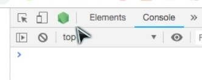

# Project layout example
* frontend
  * src
    * actions
      * [session_actions.js](./mongoDB/frontend/src/actions/session_actions.js.md)
      * [tweet_actions.js](./mongoDB/frontend/src/actions/tweet_actions.js.md)
    * components
      * main
        * [main_page.js](./mongoDB/frontend/src/components/main/main_page.js.md)
      * nav
        * [navbar_container.js](./mongoDB/frontend/src/components/nav/navbar_container.js.md)
        * [navbar.js](./mongoDB/frontend/src/components/nav/navbar.js.md)
      * profile
        * [profile_container.js](./mongoDB/frontend/src/components/profile/profile_container.js.md)
        * [profile.js](./mongoDB/frontend/src/components/profile/profile.js.md)
      * session
        * [login_form_container.js](./mongoDB/frontend/src/components/session/login_form_container.js.md)
        * [login_form.js](./mongoDB/frontend/src/components/session/login_form.js.md)
        * [signup_form_container.js](./mongoDB/frontend/src/components/session/signup_form_container.js.md)
        * [signup_form.js](./mongoDB/frontend/src/components/session/signup_form.js.md)
      * tweets
        * [tweet_box.js](./mongoDB/frontend/src/components/tweets/tweet_box.js.md)
        * [tweet_conpose_container.js](./mongoDB/frontend/src/components/tweets/tweet_conpose_container.js.md)
        * [tweet_compose.js](./mongoDB/frontend/src/components/tweets/tweet_compose.js.md)
        * [tweets_container.js](./mongoDB/frontend/src/components/tweets/tweets_container.js.md)
        * [tweets.js](./mongoDB/frontend/src/components/tweets/tweets.js.md)
      * [app.js](./mongoDB/frontend/src/components/app.js.md)
      * [root.js](./mongoDB/frontend/src/components/root.js.md)
    * reducers
      * [errors_reducer.js](./mongoDB/frontend/src/reducers/errors_reducer.js.md)
      * [root_reducer.js](./mongoDB/frontend/src/reducers/root_reducer.js.md)
      * [session_api_reducer.js](./mongoDB/frontend/src/reducers/session_api_reducer.js.md)
      * [session_errors_reducer.js](./mongoDB/frontend/src/reducers/session_errors_reducer.js.md)
      * [session_reducer.js](./mongoDB/frontend/src/reducers/session_reducer.js.md)
      * [tweets_reducer.js](./mongoDB/frontend/src/reducers/tweets_reducer.js.md)
    * store
    * util
      * [route_util.js](./mongoDB/frontend/src/util/route_util.js.md)
      * [session_api_util.js](./mongoDB/frontend/src/util/session_api_util.js.md)
      * [tweet_api_util.js](./mongoDB/frontend/src/util/tweet_api_util.js.md)
    * [index.js](./mongoDB/frontend/src/index.js.md)
* models
  * [Tweet.js](./mongoDB/models/Tweet.js.md)
  * [User.js](./mongoDB/models/User.js.md)
* routes
  * api
    * [tweets.js](./mongoDB/routes/api/tweets.js.md)
    * [users.js](./mongoDB/routes/api/users.js.md)
* validation
  * [login.js](./mongoDB/validation/login.js.md)
  * [register.js](./mongoDB/validation/register.js.md)
  * [tweets.js](./mongoDB/validation/tweets.js.md)
  * [valid-test.js](./mongoDB/validation/valid-test.js.md)
* [app.js](./mongoDB/app.js.md)
* package.json
* .gitignore


# MongoDB Altas set up

* Click `Build a cluster`
* Click the `Connect` button on the newly created cluster
* Select `Amazon Web Services` as your cloud provider
* Choose `N Virginia US-East-1` as your region
* Add a different IP address and enter `0.0.0.0/0` to allow connections from any IP
* Create a new user, Give them whatever username you like I.E. `dev`
* Click the `Autogenerate Secure Password` button and save the password for later. **DO NOT COMMIT THE PASSWORD**
* Click `Connect Your Application`
* Copy and paste the connection string, replace the `username` with the username we just created
* Replace the `password` with the auto-generated password
* DO NOT COMMIT THIS PASSWORD EVER
* Click chose a connection method
* Click Connect Your Application
* Copy and paste the connection string
* Replace the <username> with the username we just created
* Replace the <password> with the auto-generated password

Create a new directory called `config`.
Add a file to your new directory called `keys_dev.js`.
Export an object from this file which contains your Atlas connection string, configured with the username and password you have just created:
```js
module.exports = {
  MONGO_URI: "mongodb+srv://<DBUser>:<password>@cluster.mongodb.net/<DBname>?retryWrites=true&w=majority",
  secretOrKey: "secret"
};
```
**NB**: The \<DBname> field can be tricky, make sure it's correct, the default should be `test`

Create a `.gitignore` file and ignore both `config` and `node_module`

[Go to MERN-apollo.md](./MERN-apollo.md#creating-the-models)

## Basic setup:

1. `npm init`
2. Install recommended dependencies
    `npm install express mongoose passport passport-jwt jsonwebtoken body-parser bcryptjs validator concurrently axios jwt-decode`
3. `npm install -D nodemon` 

## Use Chrome to debug
In pacakage.json, setb
```json
"scripts": {
    "server:debug" : "nodemon --inspect app.js"
}
```
Then, after running the server with `npm nun server:debug`, click the hexagon in the dev tool. 

## Creating the Server

Create a file in your root directory called `app.js` if it was not generated automatically. Within it, write the following:
```js
//app.js
const express = require("express");
const app = express();
const mongoose = require('mongoose');
const db = require('./config/keys').mongoURI;
const users = require("./routes/api/users");
const bodyParser = require('body-parser');
const passport = require('passport');
const path = require('path');
const port = process.env.PORT || 5000;

if (process.env.NODE_ENV === 'production') {
    app.use(express.static('frontend/build'));
    app.get('/', (req, res) => {
        res.sendFile(path.resolve(__dirname, 'frontend', 'build', 'index.html'));
    })
}

// You can now delete our 'Hello World' route
app.use(passport.initialize());
//We also need to setup a configuration file for Passport (add this after the previous line):
require('./config/passport')(passport);


mongoose
    .connect(db, { useNewUrlParser: true })
    .then(() => console.log("Connected to MongoDB successfully"))
    .catch(err => console.log(err));

app.get("/", (req, res) => res.send("Hello World"));
app.use("/api/users", users);
app.use(bodyParser.urlencoded({ extended: false }));
app.use(bodyParser.json());


app.all('*', (req, res) => {
    console.log("Unknown route, bad request");
    console.log(req.body);
    return res.sendStatus(404);
});

app.listen(port, () => console.log(`Server is running on port ${port}`));
```

## Using nodemon

Open `package.json` and edit the following line:
```json
  "scripts": {
    "start": "node app.js",
    "server": "nodemon app.js",
    "server:debug": "nodemon --inspect app.js",
    "frontend-install": "npm install --prefix frontend",
    "frontend": "npm start --prefix frontend",
    "dev": "concurrently \"npm run server\" \"npm run frontend\"",
    "dev:debug": "concurrently \"npm run server:debug\" \"npm run frontend\"",
    "heroku-postbuild": "NPM_CONFIG_PRODUCTION=false npm install --prefix frontend && npm run build --prefix frontend"
  },
```

## Add a `.gitignore`
An example of .gitignore for MERN project:
```gitignore
# Logs
logs
*.log
npm-debug.log*
yarn-debug.log*
yarn-error.log*

# Runtime data
pids
*.pid
*.seed
*.pid.lock

# Directory for instrumented libs generated by jscoverage/JSCover
lib-cov

# Coverage directory used by tools like istanbul
coverage

# nyc test coverage
.nyc_output

# Grunt intermediate storage (http://gruntjs.com/creating-plugins#storing-task-files)
.grunt

# Bower dependency directory (https://bower.io/)
bower_components

# node-waf configuration
.lock-wscript

# Compiled binary addons (https://nodejs.org/api/addons.html)
build/Release

# Dependency directories
node_modules/
jspm_packages/
bundle.js
bundle.js.map

# TypeScript v1 declaration files
typings/

# Optional npm cache directory
.npm

# Optional eslint cache
.eslintcache

# Optional REPL history
.node_repl_history

# Output of 'npm pack'
*.tgz

# Yarn Integrity file
.yarn-integrity

# dotenv environment variables file
.env

# next.js build output
.next

/config/keys_dev.js

package-lock.json
/frontend/package-lock.json
```

## Express Routing
Create a `routes` folder in your root directory.
Create a folder within `routes` called `api`.
Create JavaScript files for each of your initial routes: `users.js`.
Follow this template to setup a test route for each file:

```js
//routes/api/users.js
const express = require("express");
const router = express.Router();
const bcrypt = require('bcryptjs');
const User = require('../../models/User');
const jwt = require('jsonwebtoken');
const keys = require('../../config/keys');
const passport = require('passport');

const validateRegisterInput = require('../../validation/register');
const validateLoginInput = require('../../validation/login');

router.get('/current', passport.authenticate('jwt', { session: false }), (req, res) => {
    res.json({
        name: req.user.name,
        password: req.user.password,
        email: req.user.email,
    });
});

router.get('/', (req, res) => {
    User.find().then(users => res.json(users));
});

router.post('/register', (req, res) => {
    const { errors, isValid } = validateRegisterInput(req.body);
    
    if (!isValid) {
        return res.status(400).json(errors);
    }
    // Check to make sure nobody has already registered with a duplicate email
    User.findOne({ email: req.body.email })
        .then(user => {
            if (user) {
                return res.status(400).json({ email: "A user has already registered with this email" })
            } else {
                // Otherwise create a new user
                const newUser = new User({
                    name: req.body.name,
                    password: req.body.password,
                    email: req.body.email
                });

                bcrypt.genSalt(10, (err, salt) => {
                    bcrypt.hash(newUser.password, salt, (err, hash) => {
                        if (err) throw err;
                        newUser.password = hash;
                        newUser.save()
                            .then(user => res.json({
                                success: true,
                                currentUser: { id: user.id, name: user.name, email: user.email, username: email.split("@")[0] }
                            }))
                            .catch(err => res.json(err));
                    });
                });
            }
        });
});

router.post('/login', (req, res) => {
    const { errors, isValid } = validateLoginInput(req.body);
    if (!isValid) {
        return res.status(422).json(errors);
    }

    const email = req.body.email;
    const password = req.body.password;

    User.findOne({ email })
        .then(user => {
            if (!user) {
                return res.status(422).json({ email: 'This user does not exist' });
            }
            bcrypt.compare(password, user.password)
                .then(isMatch => {
                    if (isMatch) {
                        const currentUser = { id: user.id, name: user.name, email: user.email, username: email.split("@")[0] };

                        jwt.sign(
                            currentUser,
                            keys.secretOrKey,
                            (err, token) => {
                                res.json({
                                    success: true,
                                    token: 'Bearer ' + token,
                                    currentUser: currentUser
                                });
                            });
                    } else {
                        return res.status(422).json({ password: 'Incorrect password' });
                    }
                });
        });
})

module.exports = router;
```

You may want to read more about [Express routing](https://expressjs.com/en/guide/routing.html).

# User Auth


## The User Model
Create a new directory called `models`
Create `User.js` inside the models folder, and require the Mongoose Schema, then put the information we need to require from a user:

```js
const mongoose = require('mongoose');
const Schema = mongoose.Schema;

const UserSchema = new Schema({
    username: {
        type: String,
        required: true
    },
    email: {
        type: String,
        required: true
    },
    password: {
        type: String,
        required: true
    },
    date: {
        type: Date,
        default: Date.now
    }
})

module.exports = User = mongoose.model('users', UserSchema);
```

## Registration and Login Functionality 
Refer to `routes/api/users.js`, the code is provided.

Before starting this section, review the documentation for [jsonwebtoken](https://www.npmjs.com/package/jsonwebtoken)


Now, let's use jsonwebtoken to sign our token. Start by creating a file called `config/keys_dev.js` and adding a key value pair to our key object:

```js
module.exports = {
  MONGO_URI: 'mongodb://<DBUser>:<password>@cluster.mongodb.net/test?retryWrites=true&w=majority',
  secretOrKey: 'secret'
}
```

**NB:** Instead of using the word secret, you may wish to generate a random key [here](https://randomkeygen.com/).
**NB2:** Sometimes You many need to choose `Version 2.2.12 or later` if it says `Invalid connection string`

Create another `config/keys_prod.js` file:
```js
module.exports = {
    mongoURI: process.env.MONGO_URI,
    secretOrKey: process.env.SECRET_OR_KEY
}
```
Finally, `config/keys.js` file:
```js
if (process.env.NODE_ENV === 'production') {
    module.exports = require('./keys_prod');
} else {
    module.exports = require('./keys_dev');
}
```

## Passport
Before starting this section, review the documentation for [passport-jwt](https://www.npmjs.com/package/passport-jwt).

Set up `app.js` and require Passport:

```js
const passport = require('passport');

// You can now delete our 'Hello World' route
app.use(passport.initialize());
//We also need to setup a configuration file for Passport (add this after the previous line):
require('./config/passport')(passport);

```

Go ahead and create this config file (passport.js) in the 'config' directory.
```js
//passport.js

const JwtStrategy = require('passport-jwt').Strategy;
const ExtractJwt = require('passport-jwt').ExtractJwt;
const mongoose = require('mongoose');
const User = mongoose.model('users');
const keys = require('../config/keys');

const options = {};
options.jwtFromRequest = ExtractJwt.fromAuthHeaderAsBearerToken();
options.secretOrKey = keys.secretOrKey;

module.exports = passport => {
  passport.use(new JwtStrategy(options, (jwt_payload, done) => {
    // This payload includes the items we specified earlier
    console.log(jwt_payload);
  }));
};
```


## Validation
[Before starting this section, review the documentation for validator](https://github.com/validatorjs/validator.js).

Create a new folder in your root directory called 'validation'. Within it, create three new files - `login.js`, `register.js`, and `valid-text.js`

```js
// valid-text.js
const validText = str => {
  return typeof str === 'string' && str.trim().length > 0;
}

module.exports = validText;
```

```js
// login.js

const Validator = require('validator');
const validText = require('./valid-text');

module.exports = function validateLoginInput(data) {
  let errors = {};

  data.email = validText(data.email) ? data.email : '';
  data.password = validText(data.password) ? data.password : '';

  if (!Validator.isEmail(data.email)) {
    errors.email = 'Email is invalid';
  }

  if (Validator.isEmpty(data.email)) {
    errors.email = 'Email field is required';
  }

  if (Validator.isEmpty(data.password)) {
    errors.password = 'Password field is required';
  }

  return {
    errors,
    isValid: Object.keys(errors).length === 0
  };
};
```
Our new validation will require two password fields to be passed on registration so that we can check whether they match:

```js
// register.js

const Validator = require('validator');
const validText = require('./valid-text');

module.exports = function validateRegisterInput(data) {
  let errors = {};

  data.username = validText(data.username) ? data.username : '';
  data.email = validText(data.email) ? data.email : '';
  data.password = validText(data.password) ? data.password : '';
  data.password2 = validText(data.password2) ? data.password2 : '';

  if (!Validator.isLength(data.username, { min: 2, max: 30 })) {
    errors.username = 'Username must be between 2 and 30 characters';
  }

  if (Validator.isEmpty(data.username)) {
    errors.username = 'Username field is required';
  }

  if (Validator.isEmpty(data.email)) {
    errors.email = 'Email field is required';
  }

  if (!Validator.isEmail(data.email)) {
    errors.email = 'Email is invalid';
  }

  if (Validator.isEmpty(data.password)) {
    errors.password = 'Password field is required';
  }

  if (!Validator.isLength(data.password, { min: 6, max: 30 })) {
    errors.password = 'Password must be at least 6 characters';
  }

  if (Validator.isEmpty(data.password2)) {
    errors.password2 = 'Confirm Password field is required';
  }

  if (!Validator.equals(data.password, data.password2)) {
    errors.password2 = 'Passwords must match';
  }

  return {
    errors,
    isValid: Object.keys(errors).length === 0
  };
};
```

## Further Reading

* [Promises in JavaScript](https://developers.google.com/web/fundamentals/primers/promises)
* [SQL vs. NoSQL](https://www.janbasktraining.com/blog/sql-vs-nosql/)
* [Async functions](https://developer.mozilla.org/en-US/docs/Web/JavaScript/Reference/Statements/async_function)


# React Setup

Before starting this section, you will want to review the [Create React App user guide](https://github.com/facebook/create-react-app/blob/master/packages/react-scripts/template/README.md).

* In the root directory of your project, run `npx create-react-app frontend --use-npm` - this will install a new React application in a new folder called 'frontend'.

* If you look in the 'frontend' directory, you will notice that it has its own node_modules folder. Make sure to .gitignore this folder.
* When setting up routes for our React app, we don't want to be required to type the full path; we would rather just write something like '/api/users/:id'. To do this we will need to add a key-value pair to the `frontend/package.json`:
 `"proxy": "http://localhost:5000"`
* React runs on its own development server - localhost:3000. While we could write separate commands to run each server, this would quickly become rote. We will use an npm package called 'concurrently' to run both servers at once.
  * ( As a sidenote, making an axios request with a proxy will first run an API request to localhost:300 and then redirect the request to localhost:500. You may get a console error saying that the route, localhost:300/api/users/ does not exist. This error is okay, as axios is making a request to both servers at this point. )
* Navigate to the root directory of your project

* Now, if we type `npm run dev` in the terminal, both of our servers will start running. You can view the frontend on `localhost:3000`
* You may find the Chrome React Developer Tools and Redux DevTools useful for your project. If you installed the 'ES7 React/Redux/GraphQL/React-Native snippets' extension in VS Code, you can run 'rfc => tab' to create a functional component or 'rcc => tab' to create a class component. (make sure to review the documentation for this extension).

## Axios and jwt-decode

[axios](https://www.npmjs.com/package/axios) and [jwt-decode](https://www.npmjs.com/package/jwt-decode) were added to our frontend so that we can fetch information from our server and parse the user's token:

## File Structure

Start by setting up your file structure in the `frontend/src` directory:
```
actions
components
reducers
store
util
```

## Store
Within the `store` directory, create a new file called `store.js`:

```js
import { createStore, applyMiddleware } from 'redux';
import thunk from 'redux-thunk';
import logger from 'redux-logger';

import rootReducer from '../reducers/root_reducer';

const configureStore = (preloadedState = {}) => (
  createStore(
    rootReducer,
    preloadedState,
    applyMiddleware(thunk, logger)
  )
);

export default configureStore;
```

# Frontend Auth

## Setting Axios Headers
You may wish to review the [documentation](https://www.npmjs.com/package/axios) for axios before proceeding with this tutorial.

Conveniently, axios allows us to set a common header for requests. We only have to do this once upon login (or when the user refreshes the page when we check to make sure the token has not expired). Let's create a new file in our `util` directory called s`ession_api_util.js`. We'll create a `setAuthToken` method to either set or delete the common header dependent on whether the token is passed into our method:

```js
// frontend/src/util/session_api_util.js

import axios from 'axios';

export const setAuthToken = token => {
  if (token) {
    axios.defaults.headers.common['Authorization'] = token;
  } else {
    delete axios.defaults.headers.common['Authorization'];
  }
};
```
We can pass in a falsey value to our function to ensure that the token will be removed from memory once our user is logged out or when the token has expired.

## User Logout
We will store a boolean value in our state to indicate that the user is authenticated. We can map this slice of state to our components to selectively render information depending on whether our user is logged in. It may seem a bit counterintuitive to set up logout before login, but we want to start building our app from the entry file and will need to handle logout there. In this example, we've attempted to make the redux pattern as similar as possible to the one you are familiar with from the full stack project examples. Delete the preconfigured component files from `create-react-app` and create a new file in `src` called `index.js`. Let's configure that file now:

```js
// src/index.js

import React from 'react';
import ReactDOM from 'react-dom';

// We will create this component shortly
import Root from './components/root';

// We set this up in the last section
import configureStore from './store/store';

// We will use this to parse the user's session token
import jwt_decode from 'jwt-decode';

// The session utility we just created
import { setAuthToken } from './util/session_api_util';

// We have not created this action yet, but will do so in the next step
import { logout } from './actions/session_actions';

document.addEventListener('DOMContentLoaded', () => {
  let store;

  // If a returning user has a session token stored in localStorage
  if (localStorage.jwtToken) {

    // Set the token as a common header for all axios requests
    setAuthToken(localStorage.jwtToken);

    // Decode the token to obtain the user's information
    const decodedUser = jwt_decode(localStorage.jwtToken);

    // Create a preconfigured state we can immediately add to our store
    const preloadedState = { session: { isAuthenticated: true, user: decodedUser } };

    store = configureStore(preloadedState);

    const currentTime = Date.now() / 1000;

    // If the user's token has expired
    if (decodedUser.exp < currentTime) {
      // Logout the user and redirect to the login page
      store.dispatch(logout());
      window.location.href = '/login';
    }
  } else {
    // If this is a first time user, start with an empty store
    store = configureStore({});
  }
  // Render our root component and pass in the store as a prop
  const root = document.getElementById('root');

  ReactDOM.render(<Root store={store} />, root);
});
```

## Logout Action

Create a new file in your `actions` folder called `session_actions.js`. Let's create our logout action:
```js
// src/actions/session_actions.js

// Although there's only one function here so far, let's import the whole file since we will be adding more later
import * as APIUtil from '../util/session_api_util';
import jwt_decode from 'jwt-decode';

// This pattern should be familiar to you from the full stack project

export const RECEIVE_USER_LOGOUT = "RECEIVE_USER_LOGOUT";

export const logoutUser = () => ({
    type: RECEIVE_USER_LOGOUT
});

export const logout = () => dispatch => {
    // Remove the token from local storage
    localStorage.removeItem('jwtToken')
    // Remove the token from the common axios header
    APIUtil.setAuthToken(false)
    // Dispatch a logout action
    dispatch(logoutUser())
};
```

## Session Reducer

We know we will be adding tweets and errors later, so we might as well set up our root reducer:
```js
// src/reducers/root_reducer.js

import { combineReducers } from 'redux';
import session from './session_reducer';

const RootReducer = combineReducers({
  session
});

export default RootReducer;
```

Now we can create our session reducer:

```js
import { RECEIVE_USER_LOGOUT } from '../actions/session_actions';

export default function(state = initialState, action) {
  switch (action.type) {
    case RECEIVE_USER_LOGOUT:
      return {
        isAuthenticated: false,
        user: undefined
      };
    default:
      return state;
  }
};
```

## Configuring the Root Component

Now that we're set up to log out our user, we can proceed to configure our root component with the hash router and provide the store to each sub-component:

```js
// src/components/root.js

import React from 'react';
import { Provider } from 'react-redux';
import { HashRouter } from 'react-router-dom';
// We'll create this soon
import App from './app';

const Root = ({ store }) => (
  <Provider store={ store }>
    <HashRouter>
      <App />
    </HashRouter>
  </Provider>
);

export default Root;
```

## Route Util
You may recall from the full stack project that we created our own custom components to set up Auth and Protected routes. We will do something similar for this project. Start by creating a file in your `util` folder called `route_util.js`. We'll configure our routing components here:
```js
// src/util/route_util.js

import React from 'react';
import { connect } from 'react-redux';
import { Route, Redirect, withRouter } from 'react-router-dom';

// Passed in from parent component or from mapStateToProps
const Auth = ({ component: Component, path, loggedIn, exact }) => (
  <Route path={path} exact={exact} render={(props) => (
    !loggedIn ? (
      <Component {...props} />
    ) : (
        // Redirect to the tweets page if the user is authenticated
      <Redirect to="/tweets" />
    )
  )} />
);

const Protected = ({ component: Component, loggedIn, ...rest }) => (
  <Route
    {...rest}
    render={props =>
      loggedIn ? (
        <Component {...props} />
      ) : (
        // Redirect to the login page if the user is already authenticated
        <Redirect to="/login" />
      )
    }
  />
);

// Use the isAuthenitcated slice of state to determine whether a user is logged in

const mapStateToProps = state => (
  {loggedIn: state.session.isAuthenticated}
);

export const AuthRoute = withRouter(connect(mapStateToProps)(Auth));

export const ProtectedRoute = withRouter(connect(mapStateToProps)(Protected));
```
We'll use our custom Protected component to ensure users can only access certain information if they are logged in. If the user visits a login or signup page, the Auth component will redirect them to tweets page if they are already logged in.

## Route Setup

We're ready to begin configuring our routes. When we set up our root component, we wrapped a yet-to-be-created component called App in `Provider` and `HashRouter`. Let's create this component now in a file called `app.js`:

```js
// src/components/app.js

import React from 'react';
import { AuthRoute, ProtectedRoute } from '../util/route_util';
import { Switch } from 'react-router-dom';

import MainPage from './main/main_page';

const App = () => (
    <Switch>
        <AuthRoute exact path="/" component={MainPage} />
    </Switch>
);

export default App;
```
We'll come back to this in few minutes and add more routes. At this point, you should be thinking about your own project and which kinds of routes are required for the unique needs of your app.

Let's make a main page component that users will see when they land on the home page:

```js
// src/components/main/main_page.js

import React from 'react';

class MainPage extends React.Component {

  render() {
    return (
      <div>
        <h1>A Twitter Clone</h1>
        <footer>
          Copyright &copy; 2019 Chirper
        </footer>
      </div>
    );
  }
}

export default MainPage;
```

Returning to `app.js`, let's think about the remaining Auth routes and components we'll need to complete our application. It may be useful to have a navigation bar that appears on every page. We will also need to render components with forms that allow our users to sign up or login.

```js
// src/components/app.js

import React from 'react';
import { AuthRoute, ProtectedRoute } from '../util/route_util';
import { Switch } from 'react-router-dom';
import NavBarContainer from './nav/navbar_container';

import MainPage from './main/main_page';
import LoginFormContainer from './session/login_form_container';
import SignupFormContainer from './session/signup_form_container';

const App = () => (
  <div>
    <NavBarContainer />
    <Switch>
        <AuthRoute exact path="/" component={MainPage} />
        <AuthRoute exact path="/login" component={LoginFormContainer} />
        <AuthRoute exact path="/signup" component={SignupFormContainer} />
    </Switch>
  </div>
);

export default App;
```

## Navigation Bar
Our navigation bar appears on every page, and will contain either navigation links or session links depending on whether the user is logged in. We'll use the `isAuthenticated` boolean in our state to determine which set of links to render, so we'll need to map state to props. We also want to map our logout action to this component so that our user always has the option to end their session. Let's start by building a container for our navigation component:

```js
// src/components/nav/navbar_container.js

import { connect } from 'react-redux';
import { logout } from '../../actions/session_actions';

import NavBar from './navbar';

const mapStateToProps = state => ({
  loggedIn: state.session.isAuthenticated
});

export default connect(
  mapStateToProps,
  { logout }
)(NavBar);
```

And now we create the NavBar component:

```js
// src/components/nav/navbar.js

import React from 'react';
import { Link } from 'react-router-dom'
import './navbar.css'

class NavBar extends React.Component {
  constructor(props) {
    super(props);
    this.logoutUser = this.logoutUser.bind(this);
    this.getLinks = this.getLinks.bind(this);
  }

  logoutUser(e) {
      e.preventDefault();
      this.props.logout();
  }

  // Selectively render links dependent on whether the user is logged in
  getLinks() {
      if (this.props.loggedIn) {
        return (
            <div>
                <Link to={'/tweets'}>All Tweets</Link>
                <Link to={'/profile'}>Profile</Link>
                <Link to={'/new_tweet'}>Write a Tweet</Link>
                <button onClick={this.logoutUser}>Logout</button>
            </div>
        );
      } else {
        return (
            <div>
                <Link to={'/signup'}>Signup</Link>
                <Link to={'/login'}>Login</Link>
            </div>
        );
      }
  }

  render() {
      return (
        <div>
            <h1>Chirper</h1>
            { this.getLinks() }
        </div>
      );
  }
}

export default NavBar;
```

# Login and Signup

## Session Errors

More likely than not, we will need to handle errors for other forms in our application in addition to the session errors. Since this is the case, let's make an errors reducer to handle all of our errors:

```js
// src/reducers/errors_reducer.js

import { combineReducers } from 'redux';

import SessionErrorsReducer from './session_errors_reducer';

export default combineReducers({
  session: SessionErrorsReducer
});
```

Don't forget to add this errors reducer to the root reducer.

Now, let's create the session errors reducer. When we receieve a new set session errors, we want to replace the old errors in the state. If we successfully log the user in, we want to clear the session errors. Let's get started.

```js
src/reducers/session_errors_reducer.js

import {
  RECEIVE_SESSION_ERRORS,
  RECEIVE_CURRENT_USER,
} from '../actions/session_actions';

const _nullErrors = [];

const SessionErrorsReducer = (state = _nullErrors, action) => {
  Object.freeze(state);
  switch(action.type) {
    case RECEIVE_SESSION_ERRORS:
      return action.errors;
    case RECEIVE_CURRENT_USER:
      return _nullErrors;
    default:
      return state;
  }
};

export default SessionErrorsReducer;
```

In order for this to work, we'll need to actually create these session actions. While we're at it, let's write their corresponding login and signup methods.


```js
// src/actions/session_actions.js

import * as APIUtil from '../util/session_api_util';
import jwt_decode from 'jwt-decode';

export const RECEIVE_CURRENT_USER = "RECEIVE_CURRENT_USER";
export const RECEIVE_SESSION_ERRORS = "RECEIVE_SESSION_ERRORS";
export const RECEIVE_USER_LOGOUT = "RECEIVE_USER_LOGOUT";
export const RECEIVE_USER_SIGN_IN = "RECEIVE_USER_SIGN_IN";

// We'll dispatch this when our user signs in
export const receiveCurrentUser = currentUser => ({
    type: RECEIVE_CURRENT_USER,
    currentUser
});

// This will be used to redirect the user to the login page upon signup
export const receiveUserSignIn = () => ({
    type: RECEIVE_USER_SIGN_IN
});
  
// We dispatch this one to show authentication errors on the frontend
export const receiveErrors = errors => ({
    type: RECEIVE_SESSION_ERRORS,
    errors
});

// When our user is logged out, we will dispatch this action to set isAuthenticated to false
export const logoutUser = () => ({
    type: RECEIVE_USER_LOGOUT
});

// Upon signup, dispatch the approporiate action depending on which type of response we receieve from the backend
export const signup = user => dispatch => (
    APIUtil.signup(user).then(() => (
        dispatch(receiveUserSignIn())
    ), err => (
        dispatch(receiveErrors(err.response.data))
    ))
);

// Upon login, set the session token and dispatch the current user. Dispatch errors on failure.
export const login = user => dispatch => (
    APIUtil.login(user).then(res => {
        const { token } = res.data;
        localStorage.setItem('jwtToken', token);
        APIUtil.setAuthToken(token);
        const decoded = jwt_decode(token);
        dispatch(receiveCurrentUser(decoded))
    })
    .catch(err => {
        dispatch(receiveErrors(err.response.data));
    })
)

// We wrote this one earlier
export const logout = () => dispatch => {
    localStorage.removeItem('jwtToken')
    APIUtil.setAuthToken(false)
    dispatch(logoutUser())
};
```
Finally, we need to create the actual requests we are making from `APIUtil`. In our `util/session_api_util.js` file, let's add two methods which each take user data return a Promise:

```js
// src/util/session_api_util.js

import axios from 'axios';

// We've been using this method in previos steps
export const setAuthToken = token => {
  if (token) {
    axios.defaults.headers.common['Authorization'] = token;
  } else {
    delete axios.defaults.headers.common['Authorization'];
  }
};

export const signup = (userData) => {
  return axios.post('/api/users/register', userData);
};

export const login = (userData) => {
  return axios.post('/api/users/login', userData);
};
```
You might be thinking that keeping these axios requests in their own utility file is a bit useless. In fact, many developers do handle their API calls within the action itself. We followed this convention since it is similar to the format you are already familiar with.

The final step in setting up the redux cycle is to complete the session reducer:


```js
// src/reducers/session_api_reducer.js

import { RECEIVE_CURRENT_USER, 
         RECEIVE_USER_LOGOUT, 
         RECEIVE_USER_SIGN_IN } from '../actions/session_actions';

const initialState = {
  isAuthenticated: false,
  user: {}
};

export default function(state = initialState, action) {
  switch (action.type) {
    case RECEIVE_CURRENT_USER:
      return {
        ...state,
        isAuthenticated: !!action.currentUser,
        user: action.currentUser
      };
    case RECEIVE_USER_LOGOUT:
      return {
        isAuthenticated: false,
        user: undefined
      };
    case RECEIVE_USER_SIGN_IN:
      return {
        ...state,
        isSignedIn: true
      }
    default:
      return state;
  }
};
```

## Session Forms

Finally, let's create forms our our users to sign up or login. Both of these forms are similar, so you could mapStateToProps as we did for the NavBar component and do some conditional rendering to display the appropriate session form. However, for the sake of complexity, we have separated these into two forms for this tutorial.

```js
// src/components/session/login_form_container.js

import { connect } from 'react-redux';
import { login } from '../../actions/session_actions';
import LoginForm from './login_form';

const mapStateToProps = (state) => {
  return {
    errors: state.errors.session
  };
};

const mapDispatchToProps = (dispatch) => {
  return {
    login: user => dispatch(login(user))
  }
}

export default connect(
  mapStateToProps,
  mapDispatchToProps
)(LoginForm);
```

```js
// src/components/session/login_form.js

import React from 'react';
import { withRouter } from 'react-router-dom';

class LoginForm extends React.Component {
  constructor(props) {
    super(props);

    this.state = {
      email: '',
      password: '',
      errors: {}
    };

    this.handleSubmit = this.handleSubmit.bind(this);
    this.renderErrors = this.renderErrors.bind(this);
  }

  // Once the user has been authenticated, redirect to the Tweets page
  componentWillReceiveProps(nextProps) {
    if (nextProps.currentUser === true) {
      this.props.history.push('/tweets');
    }

    // Set or clear errors
    this.setState({errors: nextProps.errors})
  }

  // Handle field updates (called in the render method)
  update(field) {
    return e => this.setState({
      [field]: e.currentTarget.value
    });
  }

  // Handle form submission
  handleSubmit(e) {
    e.preventDefault();

    let user = {
      email: this.state.email,
      password: this.state.password
    };

    this.props.login(user); 
  }

  // Render the session errors if there are any
  renderErrors() {
    return(
      <ul>
        {Object.keys(this.state.errors).map((error, i) => (
          <li key={`error-${i}`}>
            {this.state.errors[error]}
          </li>
        ))}
      </ul>
    );
  }

  render() {
    return (
      <div>
        <form onSubmit={this.handleSubmit}>
          <div>
              <input type="text"
                value={this.state.email}
                onChange={this.update('email')}
                placeholder="Email"
              />
            <br/>
              <input type="password"
                value={this.state.password}
                onChange={this.update('password')}
                placeholder="Password"
              />
            <br/>
            <input type="submit" value="Submit" />
            {this.renderErrors()}
          </div>
        </form>
      </div>
    );
  }
}

export default withRouter(LoginForm);
```

```js
// src/components/session/signup_form_container.js

import { connect } from 'react-redux';
import { signup } from '../../actions/session_actions';
import SignupForm from './signup_form';

const mapStateToProps = (state) => {
  return {
    signedIn: state.session.isSignedIn,
    errors: state.errors.session
  };
};

const mapDispatchToProps = (dispatch) => {
  return {
    signup: user => dispatch(signup(user))
  }
}

export default connect(
  mapStateToProps,
  mapDispatchToProps
)(SignupForm);
```

```js
// src/components/session/signup_form.js

import React from 'react';
import { withRouter } from 'react-router-dom';

class SignupForm extends React.Component {
  constructor(props) {
    super(props);
    this.state = {
      email: '',
      username: '',
      password: '',
      password2: '',
      errors: {}
    };

    this.handleSubmit = this.handleSubmit.bind(this);
    this.clearedErrors = false;
  }

  componentWillReceiveProps(nextProps) {
    if (nextProps.signedIn === true) {
      this.props.history.push('/login');
    }

    this.setState({errors: nextProps.errors})
  }

  update(field) {
    return e => this.setState({
      [field]: e.currentTarget.value
    });
  }

  handleSubmit(e) {
    e.preventDefault();
    let user = {
      email: this.state.email,
      username: this.state.username,
      password: this.state.password,
      password2: this.state.password2
    };

    this.props.signup(user, this.props.history); 
  }

  renderErrors() {
    return(
      <ul>
        {Object.keys(this.state.errors).map((error, i) => (
          <li key={`error-${i}`}>
            {this.state.errors[error]}
          </li>
        ))}
      </ul>
    );
  }

  render() {
    return (
      <div className="login-form-container">
        <form onSubmit={this.handleSubmit}>
          <div className="login-form">
            <br/>
              <input type="text"
                value={this.state.email}
                onChange={this.update('email')}
                placeholder="Email"
              />
            <br/>
              <input type="text"
                value={this.state.username}
                onChange={this.update('username')}
                placeholder="Username"
              />
            <br/>
              <input type="password"
                value={this.state.password}
                onChange={this.update('password')}
                placeholder="Password"
              />
            <br/>
              <input type="password"
                value={this.state.password2}
                onChange={this.update('password2')}
                placeholder="Confirm Password"
              />
            <br/>
            <input type="submit" value="Submit" />
            {this.renderErrors()}
          </div>
        </form>
      </div>
    );
  }
}

export default withRouter(SignupForm);
```


# Wrapping Up the Front End

## Axios Calls

Let's start by adding some API calls so that we can fetch all tweets, fetch individual tweets, and write new tweets. Make a new file in your `util` directory called `tweet_api_util.js`:

```js
// src/util/tweet_api_util.js

import axios from 'axios';

export const getTweets = () => {
  return axios.get('/api/tweets')
};

export const getUserTweets = id => {
  return axios.get(`/api/tweets/user/${id}`)
};

export const writeTweet = data => {
  return axios.post('/api/tweets/', data)
};
```

## Tweet Actions

Now, we will add actions for our tweets. Create a new filed in `actions` called `tweet_actions.js`:

```js// src/actions/tweet_actions.js

import { getTweets, getUserTweets, writeTweet } from '../util/tweet_api_util';

export const RECEIVE_TWEETS = "RECEIVE_TWEETS";
export const RECEIVE_USER_TWEETS = "RECEIVE_USER_TWEETS";
export const RECEIVE_NEW_TWEET = "RECEIVE_NEW_TWEET";

export const receiveTweets = tweets => ({
  type: RECEIVE_TWEETS,
  tweets
});

export const receiveUserTweets = tweets => ({
  type: RECEIVE_USER_TWEETS,
  tweets
});

export const receiveNewTweet = tweet => ({
  type: RECEIVE_NEW_TWEET,
  tweet
})

export const fetchTweets = () => dispatch => (
  getTweets()
    .then(tweets => dispatch(receiveTweets(tweets)))
    .catch(err => console.log(err))
);

export const fetchUserTweets = id => dispatch => (
  getUserTweets(id)
    .then(tweets => dispatch(receiveUserTweets(tweets)))
    .catch(err => console.log(err))
);

export const composeTweet = data => dispatch => (
  writeTweet(data)
    .then(tweet => dispatch(receiveNewTweet(tweet)))
    .catch(err => console.log(err))
);
```

## Reducer
Create a new reducer for your tweets (don't forget to import this into your root reducer).

```js
// src/reducers/tweets_reducer.js

import { RECEIVE_TWEETS, RECEIVE_USER_TWEETS, RECEIVE_NEW_TWEET } from '../actions/tweet_actions';
  
  const TweetsReducer = (state = { all: {}, user: {}, new: undefined }, action) => {
    Object.freeze(state);
    let newState = Object.assign({}, state);
    switch(action.type) {
      case RECEIVE_TWEETS:
        newState.all = action.tweets.data;
        return newState;
      case RECEIVE_USER_TWEETS:
        newState.user = action.tweets.data;
        return newState;
      case RECEIVE_NEW_TWEET:
        newState.new = action.tweet.data
        return newState;
      default:
        return state;
    }
  };
  
  export default TweetsReducer;
  ```

  ## Routes

  Let's add some routes for three new components:

```js
// src/components/app.js

import React from 'react';
import { AuthRoute, ProtectedRoute } from '../util/route_util';
import { Switch } from 'react-router-dom';
import NavBarContainer from './nav/navbar_container';

import TweetsContainer from './tweets/tweets_container';
import MainPage from './main/main_page';
import LoginFormContainer from './session/login_form_container';
import SignupFormContainer from './session/signup_form_container';
import ProfileContainer from './profile/profile_container';
import TweetComposeContainer from './tweets/tweet_compose_container';

const App = () => (
  <div>
    <NavBarContainer />
    <Switch>
      <AuthRoute exact path="/" component={MainPage} />
      <AuthRoute exact path="/login" component={LoginFormContainer} />
      <AuthRoute exact path="/signup" component={SignupFormContainer} />

      <ProtectedRoute exact path="/tweets" component={TweetsContainer} />
      <ProtectedRoute exact path="/profile" component={ProfileContainer} />
      <ProtectedRoute exact path="/new_tweet" component={TweetComposeContainer} />
    </Switch>
  </div>
);

export default App;
```

## All Tweets

Make a new `tweets` directory in `components`. We'll create the next few files here. Let's start by creating a component which allows logged in users to view all tweets by all users. Let's build the container first:

```js
// src/components/tweets/tweets_container.js

import { connect } from 'react-redux';
import { fetchTweets } from '../../actions/tweet_actions';
import Tweets from './tweets';

const mapStateToProps = (state) => {
  return {
    tweets: Object.values(state.tweets.all)
  };
};

const mapDispatchToProps = dispatch => {
  return {
    fetchTweets: () => dispatch(fetchTweets())
  };
};

export default connect(mapStateToProps, mapDispatchToProps)(Tweets);
```
Let's make a component which can render individual tweets.

```js
// src/components/tweets/tweet_box.js

import React from 'react';

class TweetBox extends React.Component {
  render() {
    return (
        <div>
            <h3>{this.props.text}</h3>
        </div>
    );
  }
}

export default TweetBox;
```
Although we're keeping it simple for this tutorial, we would also want to render some additional information (such as username and datetime) on this component. Separating this functionality into its own component allows us to easily standardize the way we represent tweets across components.

Now we can make the Tweets component:


```js
// src/components/tweets/tweets.js

import React from 'react';
import { withRouter } from 'react-router-dom';
import TweetBox from './tweet_box';

class Tweet extends React.Component {
  constructor(props) {
    super(props);

    this.state = {
      tweets: []
    }
  }

  componentWillMount() {
    this.props.fetchTweets();
  }

  componentWillReceiveProps(newState) {
    this.setState({ tweets: newState.tweets });
  }

  render() {
    if (this.state.tweets.length === 0) {
      return (<div>There are no Tweets</div>)
    } else {
      return (
        <div>
          <h2>All Tweets</h2>
          {this.state.tweets.map(tweet => (
            <TweetBox key={tweet._id} text={tweet.text} />
          ))}
        </div>
      );
    }
  }
}

export default withRouter(Tweet);
```

## Profile

Let's setup a similar component to render our user's tweets on their profile page (you'll want to create a new directory for this):

```js
// src/components/profile/profile_container.js

import { connect } from 'react-redux';
import { fetchUserTweets } from '../../actions/tweet_actions';
import Profile from './profile';

const mapStateToProps = (state) => {
  return {
    tweets: Object.values(state.tweets.user),
    currentUser: state.session.user
  };
};

const mapDispatchToProps = dispatch => {
  return {
    fetchUserTweets: id => dispatch(fetchUserTweets(id))
  };
};

export default connect(mapStateToProps, mapDispatchToProps)(Profile);
```

```js
// src/components/profile/profile.js

import React from 'react';
import TweetBox from '../tweets/tweet_box';

class Profile extends React.Component {
    constructor(props) {
        super(props);

        this.state = {
            tweets: []
        }
    }
    
    componentWillMount() {
        console.log(this.props.currentUser.id)
        this.props.fetchUserTweets(this.props.currentUser.id);
    }

    componentWillReceiveProps(newState) {
        this.setState({ tweets: newState.tweets });
    }   
    
    render() {
        if (this.state.tweets.length === 0) {
          return (<div>This user has no Tweets</div>)
        } else {
          return (
            <div>
              <h2>All of This User's Tweets</h2>
              {this.state.tweets.map(tweet => (
                <TweetBox key={tweet._id} text={tweet.text} />
              ))}
            </div>
          );
        }
      }
}

export default Profile;
```

## Composing Tweets

Finally, let's create a component which allows a user to post a new tweet. Once they've done so, we want the tweet to appear below the submission form.

```js
// src/components/tweets/tweet_compose_container.js

import { connect } from 'react-redux';
import { composeTweet } from '../../actions/tweet_actions';
import TweetCompose from './tweet_compose';

const mapStateToProps = (state) => {
  return {
    currentUser: state.session.user,
    newTweet: state.tweets.new
  };
};

const mapDispatchToProps = dispatch => {
  return {
    composeTweet: data => dispatch(composeTweet(data))
  };
};

export default connect(mapStateToProps, mapDispatchToProps)(TweetCompose);
```

```js
// src/components/tweets/tweet_compose.js

import React from 'react';
import TweetBox from './tweet_box';

class TweetCompose extends React.Component {
  constructor(props) {
      super(props);

      this.state = {
          text: "",
          newTweet: ""
      }

      this.handleSubmit = this.handleSubmit.bind(this);
  } 

  componentWillReceiveProps(nextProps) {
      this.setState({newTweet: nextProps.newTweet.text});
  }

  handleSubmit(e) {
    e.preventDefault();
    let tweet = {
      text: this.state.text
    };

    this.props.composeTweet(tweet); 
    this.setState({text: ''})
  }

  update() {
    return e => this.setState({
      text: e.currentTarget.value
    });
  }

  render() {
    return (
        <div>
            <form onSubmit={this.handleSubmit}>
                <div>
                    <input type="textarea"
                        value={this.state.text}
                        onChange={this.update()}
                        placeholder="Write your tweet..."
                    />
                    <input type="submit" value="Submit" />
                </div>
            </form>
            <br />
            <TweetBox text={this.state.newTweet} />
        </div>
    )
  }
}

export default TweetCompose;
```

# Deploying to Heroku

## Managing Keys

We don't ever want to push our keys to GitHub or Heroku - that would allow anyone to access our database and change whatever they wanted. Let's setup our project to use environment variables when the app is deployed. Start by making two new files in your config folder - `keys_dev.js` `and keys_prod.js`. Let's setup our production keys file to use environment variables from Heroku:

```js
// keys_prod.js
module.exports = {
  mongoURI: process.env.MONGO_URI,
  secretOrKey: process.env.SECRET_OR_KEY
};
```

We can just paste over the code from our old keys file into `keys_dev.js`:

```js
// keys_dev.js
module.exports = {
  mongoURI: 'mongodb+srv://<DBUsername>:<password>@cluster.mongodb.net/test?retryWrites=true&w=majority',
  secretOrKey: 'secret'
};
```

Now, let's reconfigure `keys.js` to use one keys file or the other depending on the environment we are in:

```js
// keys.js
if (process.env.NODE_ENV === 'production') {
  module.exports = require('./keys_prod');
} else {
  module.exports = require('./keys_dev');
};
```

Don't forget to .gitignore `keys_dev`. We'll need to push `keys_prod` to Heroku - our references to the environment variables won't expose any sensitive information.